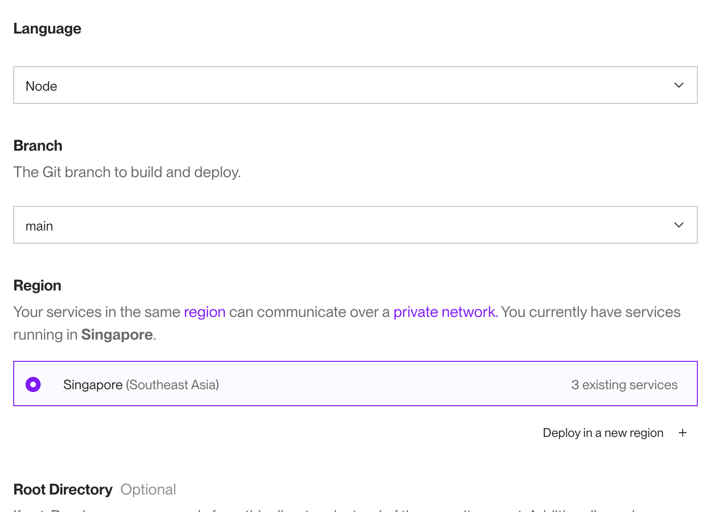
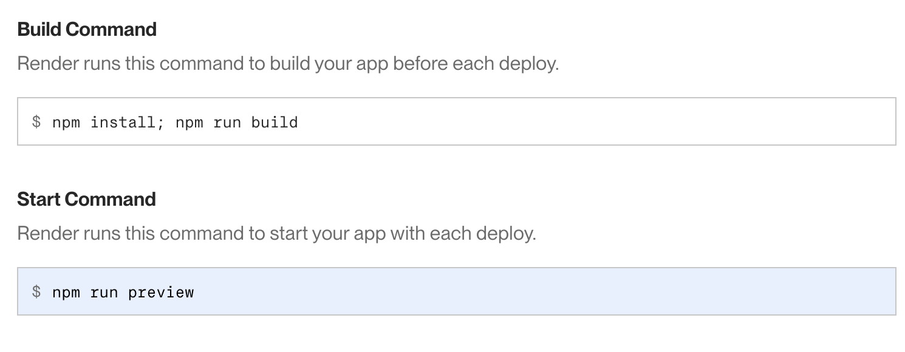
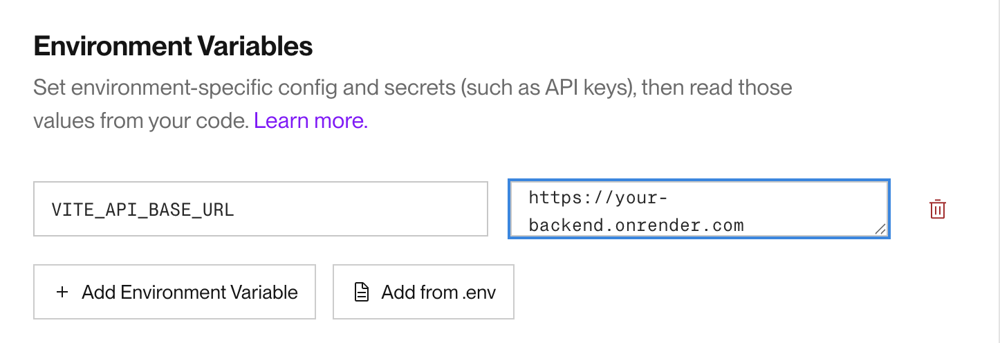

# Deploying a React Application to Render

Follow these steps to deploy your React application to [Render](https://render.com):

---

## 1. Push Your Code to GitHub

Ensure your code is pushed to a GitHub repository.

---

## 2. Create a New Web Service on Render

1. Log in to [Render](https://render.com).
2. Click **New > Web Service**.
3. Connect your GitHub repository and select the branch to deploy.

   

---

## 3. Configure Build Settings

1. Set the following build and start commands:
   - **Build Command**: `npm install; npm run build`
   - **Start Command**: `npm run preview`
2. Select **Node.js** as the environment.

   

---

## 4. Set Environment Variables (If Using a Dedicated Backend)

1. In the **Environment** section of your Render service, add an environment variable for your backend API URL:
   - **Key**: `VITE_API_BASE_URL`
   - **Value**: The URL of your backend deployed on Render (e.g., `https://your-backend.onrender.com`).

   

2. Update your API calls in your codebase. For example, in your `api.ts` file:

   ```typescript
   const BASE_URL = import.meta.env.VITE_API_BASE_URL || "http://localhost:8000";

   const api = axios.create({
       baseURL: BASE_URL,
       headers: {
           "Content-Type": "application/json",
       },
   });
   ```

---
## 5 Deploy (first round)
1. Click Deploy and wait for the build to complete.
2. At this point your deployment will be successful but you will need to do a few more things to get it to work

---
## 6. Update the ```vite.config.ts``` File
1. On the web service page on render, search for the URL that render has assigned you ```https://<your-github-repo-name>.onrender.com```
2. Then in the vite.config.ts file update the code to:
```
import { defineConfig } from "vite";
import react from "@vitejs/plugin-react-swc";
import path from "path";

export default defineConfig({
  plugins: [react()],
  preview: {
    port: parseInt(process.env.PORT || "4173"),
    host: "0.0.0.0",
    allowedHosts: ['<URL THAT RENDER ASSIGNED>'],
  },
  resolve: {
    alias: {
      "@": path.resolve(__dirname, "./src"),
    },
  }
});

```

3. You will also need to create a new file in the root of your project folder called ```vite-env.d.ts```
```
/// <reference types="vite/client" />

interface ImportMetaEnv {
    readonly VITE_API_BASE_URL: string;
  }

interface ImportMeta {
    readonly env: ImportMetaEnv;
  }
```

---
### 7. Commit and Push Changes

1. Commit the updated `vite.config.ts` and `vite-env.d.ts` files.
2. Push the changes to your GitHub repository.

---

### 8. Perform a Manual Deploy

1. In Render, click **Manual Deploy**.
2. Select **Clear Cache and Deploy** to ensure a clean build.

---

### Final Steps

- Check the logs for any errors during deployment.
- Verify the application is accessible at the assigned URL.

---

## Troubleshooting

- **Build Errors**: Ensure all dependencies are installed and the build commands are correct.
- **API Issues**: Verify the `VITE_API_BASE_URL` environment variable is set correctly.
- **Caching Problems**: Clear the cache and redeploy if changes are not reflected.

---